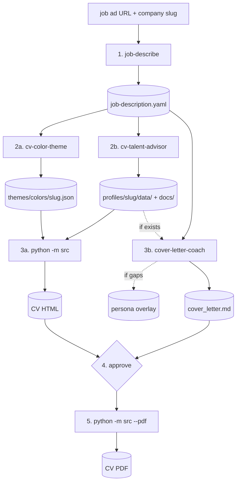

# cv-creator

A personal CV + cover-letter generator powered by Claude Code. YAML content + JSON theme → self-contained 3-page A4 HTML → optional PDF via headless Chromium. Tailored per company: brand colors extracted from the job ad, CV content rewritten for each application, cover letter drafted from a persona file, all orchestrated through Claude Code skills and subagents.

> **This is a template repository.** The `profiles/default/` folder ships with placeholder content ("Jane Doe"). Replace it with your own CV data and persona, then run the tooling to generate tailored applications for specific jobs.

## Quick start

```bash
# Install dependencies
pip install pyyaml playwright
playwright install chromium   # only for --pdf

# Build the default CV (uses profiles/default/ — replace this with your own data first)
python -m src

# Build for a specific company (uses profiles/{slug}/ + themes/colors/{slug}.json)
python -m src --company example-company --pdf
```

Output lands in `output/{company}/`.

## Making it yours

1. Replace `profiles/default/data/*.yaml` with your CV (profile, contact, work_experience, education, projects, publications).
2. Fill in `profiles/default/docs/persona.md` — the 10-section template captures beliefs, voice, red lines, and career direction. Used by `cover-letter-coach` to draft letters in your voice.
3. Edit `themes/colors/default.json` if you want a different baseline color palette.
4. Build: `python -m src --pdf`.

## Flags

| Flag | Default | Purpose |
|------|---------|---------|
| `--company` | `default` | Output folder name — use the company you're applying to |
| `--theme` | same as `--company` | Color theme from `themes/colors/` (can differ from company if reusing a theme) |
| `--profile` | same as `--company` | Content profile under `profiles/` — falls back to `default` for missing files |
| `--output` | `cv.html` | Output filename |
| `--pdf` | off | Also export a PDF via headless Chromium |

## Creating a new application

Inside Claude Code, invoke the `application-create` skill with the job ad URL and a company slug. The skill produces both a tailored CV (HTML + PDF) and a cover letter:

1. **`job-describe`** — captures role + company dossier to `profiles/{slug}/job-description.yaml`
2. **Content prep (parallel)** — `cv-color-theme` writes the theme JSON; `cv-talent-advisor` writes tailored CV YAMLs + MD mirrors
3. **Artifact materialization (parallel)** — `python -m src` builds the CV HTML; `cover-letter-coach` drafts the cover letter (and, only if the role demands convictions the default persona doesn't already express, writes a per-company persona overlay via the `persona-comparison` skill)
4. **Approve** both artifacts
5. **Export CV PDF**

### Workflow



See [CLAUDE.md](./CLAUDE.md) for the full architecture, folder layout, and skills/agents reference.

## Layout

```
cv-creator/
├── src/              Python renderer (paths, styles, renderers, pages)
├── profiles/
│   ├── default/      Baseline CV content (data/ YAML + docs/ MD)
│   └── {slug}/       Per-application overrides (data/, docs/, job-description.yaml)
├── themes/
│   ├── colors/       Per-company color theme JSONs
│   └── fonts/        Font config
├── output/           Built HTML + PDF, one folder per company
└── .claude/          Skills and agents for Claude Code
```

## Requirements

- Python 3.10+
- `pip install pyyaml playwright` (Playwright only needed for `--pdf`)
- `playwright install chromium` (once, for PDF export)
- Claude Code (optional, only needed for the tailoring pipeline — the plain `python -m src` build runs without it)

## License

MIT — see [LICENSE](./LICENSE).
